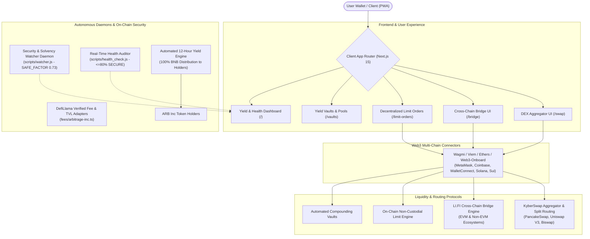

# Arbitrage Inc: All-in-Dex Suite

An institutional-grade decentralized exchange aggregator, cross-chain bridge, limit order protocol, and automated real-yield distribution engine on **BNB Smart Chain (BSC)**. Built with **Next.js 15 (App Router)**, **React 19**, **TypeScript**, **Tailwind CSS**, and **PWA (Progressive Web App)** capabilities.

**Live Application:** [https://arbitrage-inc.exchange](https://arbitrage-inc.exchange)  
**DeFiLlama Protocol:** [https://defillama.com/protocol/arbitrage-inc](https://defillama.com/protocol/arbitrage-inc)  
**Smart Contract:** [0x5ee54869ecd5e752c31af095187326d4a4d50e1c (BscScan)](https://bscscan.com/address/0x5ee54869ecd5e752c31af095187326d4a4d50e1c#readContract)  
**Community:** [Telegram](https://t.me/ArbitrageInception) | **License:** MIT

---

## 🏛️ Architecture & System Topology



---

## 🚀 Key Platform Capabilities

### 1. Multi-DEX Aggregator & Split-Order Routing (`/swap`, `/swap-all`)
- Routes swaps across multiple BSC decentralized exchanges (including PancakeSwap V2/V3, Uniswap V3, Biswap, and KyberSwap) to achieve optimal price execution, minimal price impact, and slippage protection.
- Smart order splitting algorithms reduce gas overhead and prevent front-running / MEV sandwich attacks.

### 2. Cross-Chain Bridge Integration (`/bridge`)
- Powered by the **LI.FI Cross-Chain Widget**, allowing users to transfer and swap assets seamlessly across 15+ EVM and non-EVM blockchains (Ethereum, Arbitrum, Optimism, Polygon, Base, Avalanche, and Solana) directly into BNB Smart Chain.

### 3. Non-Custodial Limit Orders (`/limit-orders`)
- Decentralized conditional trade execution on-chain without requiring deposits into centralized orderbooks or third-party custody.
- Direct wallet-to-contract signature authorizations.

### 4. Automated Yield Vaults & Staking Pools (`/vaults`)
- Curated integration with decentralized liquidity pools and auto-compounding strategies, maximizing APY/APR for liquidity providers on BSC.

### 5. 100% Real-Yield Community Distribution Engine
- **Zero Team Allocation, Zero Token Burns:** 100% of accumulated protocol fees and DEX revenue are converted into BNB and directed to the distribution contract.
- **Automated 12-Hour Payouts:** Every 12 hours, 100% of accumulated BNB is distributed programmatically to ARB Inc token holders relative to their wallet balances.

### 6. Real-Time On-Chain Security & Health Watcher Daemons
- **Solvency & Contract Watcher (`scripts/watcher.js`):** Continuously monitors RPC nodes, liquidity pool ratios, and reserve solvency using an algorithmic risk factor (`SAFE_FACTOR = 0.73`).
- **Live Health Status (`scripts/health_check.js`):** Verifies wallet balances, gas reserve health, and system safety thresholds (`<= 80% SECURE`), streaming real-time status directly to the frontend header.

### 7. Verified DeFiLlama Protocol & Fee Adapter
- Officially verified and listed on **DeFiLlama** ([arbitrage-inc](https://defillama.com/protocol/arbitrage-inc)).
- Open-source dimension adapter tracking daily on-chain protocol revenue and fees.

### 8. Progressive Web App (PWA) & Institutional Dark UI
- Fully responsive, mobile-first design built with Tailwind CSS and Framer Motion.
- PWA manifest and service worker configuration enable 1-tap installation on iOS and Android devices for native app-like performance.

### 9. Multi-Chain Wallet Connectors
- Universal Web3 authentication supporting MetaMask, Coinbase Wallet, WalletConnect v2, Phantom, OKX, and emerging multi-chain ecosystems (Solana Wallet Adapter, Sui dApp Kit).

### 10. Automated End-to-End Testing Suite
- Playwright automated smoke test suite (`scripts/maintenance/test-pages.mjs` & `playwright.config.ts`) testing critical user journeys, page loading, RPC responsiveness, and UI state integrity.

---

## 🔒 Smart Contract Verification & Renouncement

The ARB Inc token contract ownership has been **permanently renounced** to the zero address (`0x000...dEaD`).

- **Contract Address:** `0x5ee54869ecd5e752c31af095187326d4a4d50e1c`
- **Network:** BNB Smart Chain (BSC)
- **Explorer Verification:** [BscScan Read Contract](https://bscscan.com/address/0x5ee54869ecd5e752c31af095187326d4a4d50e1c#readContract)
- **Immutable Guarantee:** `owner()` returns `0x000000000000000000000000000000000000dEaD`. No entity can mint new tokens, modify tax parameters, pause trading, or alter contract rules.

---

## 🛠️ Tech Stack

| Layer | Technologies |
| :--- | :--- |
| **Framework** | Next.js 15 (App Router), React 19, TypeScript |
| **Styling & Animation** | Tailwind CSS, Framer Motion, Styled-Components |
| **Web3 & Blockchain** | Viem 2, Wagmi 3, Ethers 5, Web3-Onboard, KyberSwap Widgets, LI.FI Widget |
| **Infrastructure** | Node.js 22 LTS, Upstash Redis, Vercel Edge Network |
| **Testing & CI** | Playwright E2E Test Runner, Biome Linter |
| **Monitoring** | Custom RPC Watcher Daemons, DeFiLlama Dimension Adapters |

---

## 💻 Getting Started

### Prerequisites
- Node.js 20+
- npm, pnpm, or yarn

### Local Setup
```bash
# Clone repository
git clone https://github.com/Lukecele/Arb-Inc-All-in-Dex.git
cd Arb-Inc-All-in-Dex

# Install dependencies
npm install

# Run local development server
npm run dev
```

Open [http://localhost:3000](http://localhost:3000) in your browser.

### Run Automated Smoke Tests
```bash
# Run Playwright automated smoke tests across all routes
node scripts/maintenance/test-pages.mjs
```

---

## ⚖️ Legal & Regulatory Compliance (MiCA Notice)

This interface is an open-source, non-custodial graphical user interface (GUI) for interacting with decentralized smart contracts on BNB Smart Chain. 

- Under **Regulation (EU) 2023/1114 (Markets in Crypto-Assets - MiCA)**, this software does not constitute a Virtual Asset Service Provider (VASP), financial intermediary, custodian, or investment advisory service.
- All transactions are executed peer-to-peer directly between the user's non-custodial wallet and autonomous decentralized smart contracts.
- Users are solely responsible for their wallet security and on-chain interactions.

For detailed documentation, see:
- [Privacy Policy](https://arbitrage-inc.exchange/privacy-policy)
- [Terms of Service](https://arbitrage-inc.exchange/terms-of-service)
- [Cookie Policy](https://arbitrage-inc.exchange/cookie-policy)

---

## 📜 License

Released under the [MIT License](./LICENSE). All community contributions are welcome.

